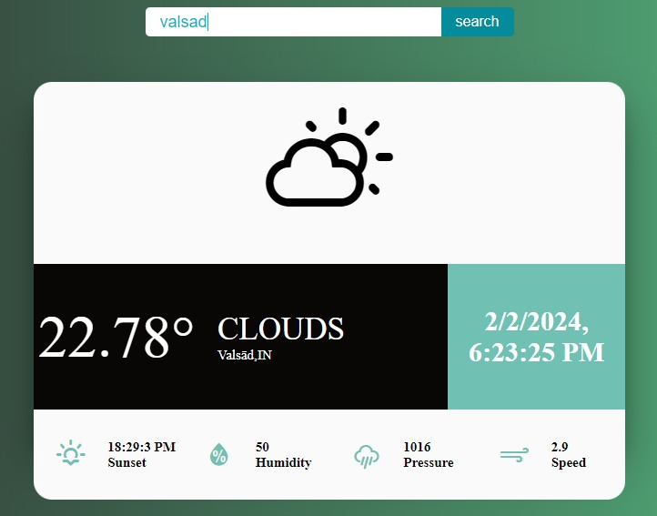
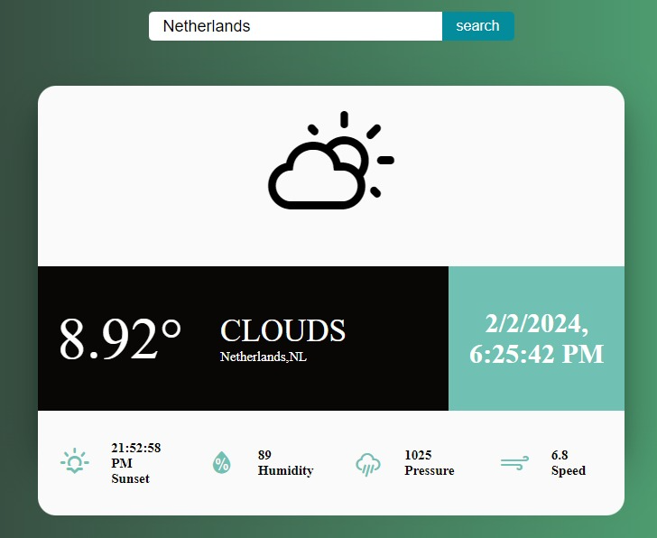

# Weather App

Crafted an elegant React weather app with OpenWeather API and React hooks. This dynamic application displays real-time temperature, humidity, pressure, and wind speed. The intuitive search feature allows users to get location-specific forecasts.

## Features

- Real-time weather information including temperature, humidity, pressure, and wind speed.
- Dynamic UI with modern design and weather icons based on current weather conditions.
- Intuitive search functionality to get weather forecasts for specific locations.
- Responsive and user-friendly interface.

## Screenshots





## Live Demo

The project is hosted on Netlify. You can access it [here](https://reactt-weather.netlify.app/) (insert your Netlify link).

## Getting Started

To run the project locally, follow these steps:
- Clone the repository:
  - [https://github.com/D4-80593-meetvasani/react-weather-app.git](https://github.com/D4-80593-meetvasani/react-weather-app.git)

- Navigate to the project directory:
  - `cd weather-app`

- Install dependencies:
  - `npm install`

- Start the development server:
  - `npm start`

The app will be available at [http://localhost:3000](http://localhost:3000).

# Project Structure
- **src/components/weathercard.js**: React component for displaying weather information.
- **src/components/temperature.js**: Main component handling the search and rendering of weather information.
- **src/style.css**: Stylesheet for the application.
- **public/**: Directory containing public assets.

# API Key
This project uses the OpenWeather API. Make sure to replace the API key in the `getWeatherInfo` function in `temperature.js` with your own key.
```javascript
let url = `https://api.openweathermap.org/data/2.5/weather?q=${searchValue}&units=metric&appid=YOUR_API_KEY`;
```

# Acknowledgments
Icons provided by the [Weather Icons](https://github.com/erikflowers/weather-icons) project.


   
